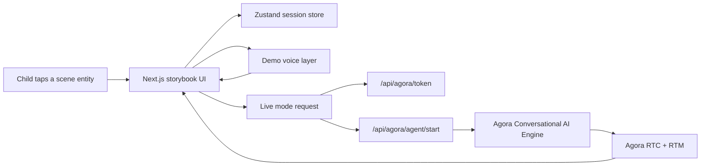

# Kids Storybook Voice Demo

A polished Next.js demo for children built on top of the official Agora Conversational AI quickstart. The app offers three playful, visual routes:

- `/eggs` for hatching five eggs into baby animal characters
- `/jungle` for exploring a picture-book jungle full of talking hotspots
- `/globe` for spinning a real 3D Earth and speaking with country guides

The default development path is safe demo mode so the UI stays explorable without live Agora credentials. Live mode keeps Agora credentials server-side and uses documented Agora token generation plus character-scoped agent startup routes.

## Architecture Overview

- `app/` holds the App Router pages and Agora API routes.
- `components/eggs`, `components/jungle`, and `components/globe` render the three experiences.
- `components/characters/CharacterStage.tsx` powers the shared conversation dock.
- `lib/characters` stores every child-facing persona as typed data.
- `lib/ai` contains prompt building and domain-boundary classification.
- `lib/game/store.ts` holds the Zustand session state.
- `lib/agora` keeps the live-mode token and agent helpers separate from the UI.



## Technology Choices

- Next.js App Router with React and TypeScript
- Tailwind CSS for the picture-book styling and motion
- amCharts 5 Maps with an orthographic projection for the interactive globe
- Official `@amcharts/amcharts5-geodata/worldLow` country boundaries
- Zustand for scene, discovery, and conversation state
- Zod for environment and API validation
- Agora documented packages already present in the quickstart:
  - `agora-rtc-sdk-ng`
  - `agora-rtm`
  - `agora-token`
  - `agora-agents`
- Vitest for unit tests
- Playwright for smoke coverage

## Local Installation

1. Use Node `24` in this repo:

   ```bash
   nvm install
   nvm use
   ```

2. Install `pnpm` if needed:

   ```bash
   corepack enable
   corepack prepare pnpm@latest --activate
   ```

3. Install dependencies:

   ```bash
   pnpm install
   ```

4. Copy the environment file:

   ```bash
   cp .env.example .env.local
   ```

5. Start the app:

   ```bash
   pnpm dev
   ```

## Environment Variables

`.env.example` includes the supported names.

- `NEXT_PUBLIC_DEMO_MODE=true` keeps the app fully explorable with mock voice behavior.
- `NEXT_PUBLIC_SHOW_DEV_PANEL=true` reveals a developer-only input for smoke testing and domain-boundary checks.
- `NEXT_PUBLIC_AGORA_APP_ID` is the only Agora value that may be exposed to the browser.
- `NEXT_AGORA_APP_CERTIFICATE` must stay server-side.
- `OPENAI_API_KEY` is optional and reserved for future classifier/provider expansion.

## Agora Console Setup

Use the developer’s own testing account and local environment variables only.

1. Select the existing Agora project that already has `rtc`, `rtm`, and `convoai` enabled.
2. Bind the repo to that project with the Agora CLI:

   ```bash
   agora login
   agora project use <your-project>
   agora project env write .env.local
   ```

3. Verify readiness:

   ```bash
   agora project doctor --deep
   ```

This project intentionally avoids creating new Agora projects or modifying account settings automatically.

## Enabling Conversational AI

The live-mode routes in `app/api/agora/agent/*` use documented `agora-agents` APIs and start one character-scoped agent session at a time. Character switching is implemented by stopping the previous session and starting a new one with updated instructions.

## Configuring STT

The current live-mode helper uses documented `AresSTT`. No separate STT vendor key is required, and no STT credential is exposed to the client.

## Configuring LLM

The current live-mode helper uses documented Agora-managed OpenAI through `OpenAI` with `gpt-4o-mini`. Character behavior is constrained by `buildCharacterPrompt(...)` and the domain classifier.

## Configuring TTS

The current live-mode helper uses documented `MiniMaxTTS`. The app keeps the voice layer modular so a future provider switch can stay inside `lib/agora/agent.ts`.

## Running Demo Mode

Demo mode is the recommended default during UI development.

```bash
NEXT_PUBLIC_DEMO_MODE=true pnpm dev
```

What demo mode gives you:

- full `/`, `/eggs`, `/jungle`, and `/globe` navigation
- hatching and entity selection flows
- browser speech-synthesis replies
- microphone permission handling and optional browser speech recognition when available
- a dev-only test input when `NEXT_PUBLIC_SHOW_DEV_PANEL=true`

## Running Live Mode

Live mode requires valid Agora values in `.env.local`.

```bash
NEXT_PUBLIC_DEMO_MODE=false pnpm dev
```

In live mode the documented server routes are ready for:

- short-lived RTC + RTM token generation
- starting one active character session
- stopping the session when the scene changes or the experience ends
- server-side prompt and credential handling

The UI is still intentionally conservative about live-agent usage during development so sessions stay short and are easy to terminate.

## Troubleshooting Microphone Permission

- If the browser blocks microphone access, the app shows a child-friendly retry message.
- Reset site microphone permissions in the browser and try again.
- On Safari or unsupported browsers, demo mode may fall back to suggestion chips and the dev panel rather than live speech recognition.

## Troubleshooting Agora Connection

- Run `agora project doctor --deep`.
- Confirm `NEXT_PUBLIC_AGORA_APP_ID` and `NEXT_AGORA_APP_CERTIFICATE` are present in `.env.local`.
- Make sure the selected Agora project has `rtc`, `rtm`, and `convoai` enabled.
- Keep live sessions short and stop them when leaving the scene.

## Replacing Placeholder Art With Rive Assets

The current visuals are CSS and emoji-based placeholders on purpose.

- Replace the main stage art inside `components/characters/LipSyncCharacter.tsx`.
- Replace egg artwork in `public/assets/animals/`.
- Replace Jungle scene and entity artwork through `lib/jungle/assets.ts`.
- Keep the component props the same so interaction logic stays untouched.

The lip-sync contract is simple:

- `mouthOpen = 0` means closed
- `mouthOpen = 1` means fully open

That makes it easy to map a future Rive parameter or animation state to the existing stage component.

## Deployment Instructions

1. Configure `.env.local` values in your hosting platform as server environment variables.
2. Keep `NEXT_AGORA_APP_CERTIFICATE`, `OPENAI_API_KEY`, and any future provider keys server-only.
3. Build and verify:

   ```bash
   pnpm run verify
   ```

4. Deploy with the same Node major version used locally.

## Testing

- Unit tests:

  ```bash
  pnpm test
  ```

- Playwright smoke tests:

  ```bash
  pnpm test:e2e
  ```

The smoke suite targets demo mode so CI does not require live Agora credentials.
